## Név

**Acxor** – Modern projektkezelő alkalmazás programozó csapatok számára.

## Leírás

Az **Acxor** egy **Jira-hoz hasonló, de egyszerűbb és felhasználóbarátabb** projektmenedzsment eszköz, amely **weben és mobilon egyaránt elérhető**.  
Kifejezetten a programozó csapatok munkájának támogatására készült, lehetővé téve a projektek áttekinthetőségét, a feladatok priorizálását és a csapatok közötti hatékony kommunikációt.

Az alkalmazásban a projektek **sprint-alapú struktúrában** szerveződnek, így a csapatok feloszthatják a munkát **taskokra és subtaskokra**, miközben a függőségi sorrend automatikusan biztosítja, hogy **egy feladat csak az előző teljesítése után kezdhető el**. A felhasználói felület egyszerű, de hatékony, így a csapat minden tagja gyorsan hozzáférhet a projektekhez, nyomon követheti a haladást, és valós időben értesülhet a változásokról.

## Erősségek

- **Közepes komplexitás:** Többet tud, mint a Trello, de nem olyan bonyolult, mint a Jira.
- **Sprint-alapú munkafolyamat:** Minden projekt alapértelmezett sprint, amely strukturált feladatkezelést tesz lehetővé.
- **Task és Subtask kezelés:** Függőségi sorrend biztosítja a logikus haladást.
- **Web és mobil kompatibilitás:** Az alkalmazás minden eszközről elérhető.
- **Egyszerű, vizuális felület:** Drag & drop támogatás, gyors áttekinthetőség.
- **Valós idejű értesítések és státuszkövetés:** A csapat mindig naprakész marad.

## Kinézet

- Modern UI/UX kialakítás, ikonok használata, hover-nél pedig név mező kiírása
- Függőlegesen baloldalt és vízszintesen felül is helyezkednek el ikonok
- Hero Logo a két sáv találkozásánál

### Függőleges sáv

#### Hero Logo ikon

Elsődleges oldal a weboldal/alkalmazás megnyitásakor. Itt helyezkednek a az alapvető információk az oldalról, külön lapok az oldal ismertetéséről, a bejelentkezés/regisztrációhoz, önálló wikihez, pár sablon projekthez ami majd ezzel a szoftverrel fog készülni, illetve a contact felület az oldal alján, ami minden résznél lesz.

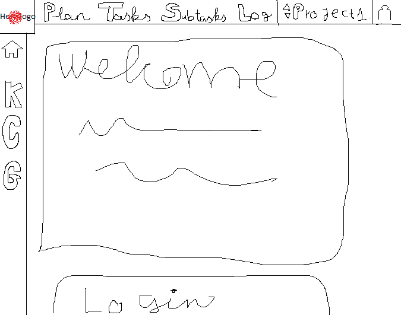

#### Főmenü ikon

Itt a majd kiválasztott projectről lesz minden információ, aminek elengedhetetlen része a bejelentkezett felhasználó és hogy a projekthez csatlakozva legyen. Felszínesebben átláthatóbb a projekt részei, mely feladatok vannak készen és melyeken dolgoznak, határidők, hatékonyság statisztika arról, ki mennyit foglalkozott eddig az adott feladatokkal esetleg.

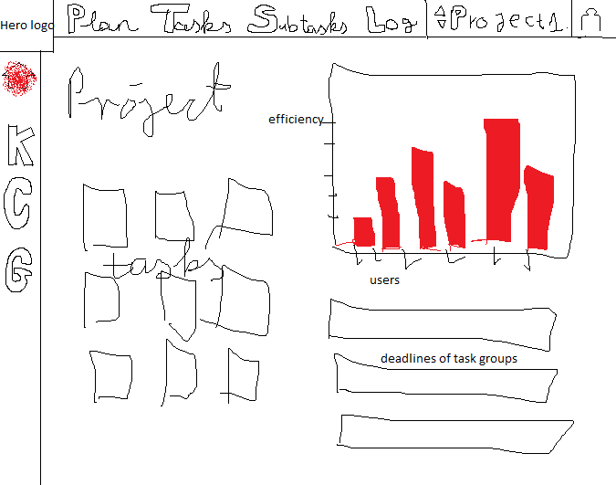

#### K ikon

A Kanban táblázatos nézetet nyitja meg, ami abban a nézetben fogja felvázolni a projektet az egyes feladatokkal, hogy mi hogyan kapcsolódik egymáshoz kisebb relációs eljárásokkal, melyek jelzik a subtask hierarchiát is.

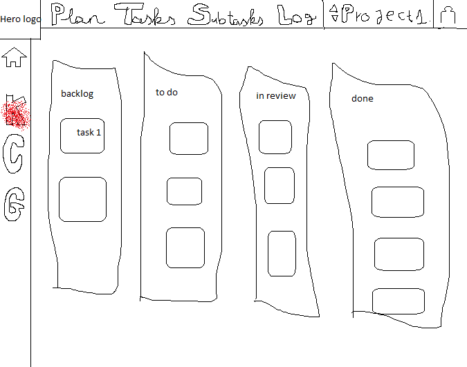

#### C ikon

Az előbb leírtak modelnézete, csak Scrumban

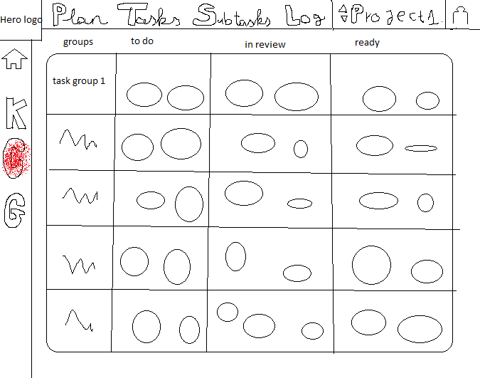

#### G ikon

A gamifikáció oldalát nyitja meg, ahol ránézhetünk a contributorok teljesítményére. Ki milyen szinten áll, mennyi xp-je van, milyen badge-jei, és kb. mennyi xp-t fog eddig bezsebelni a projektből(Versengést idézhet elő azért a plusz 10xp-ért a projekt végére motiválva a felhasználókat a munkára)

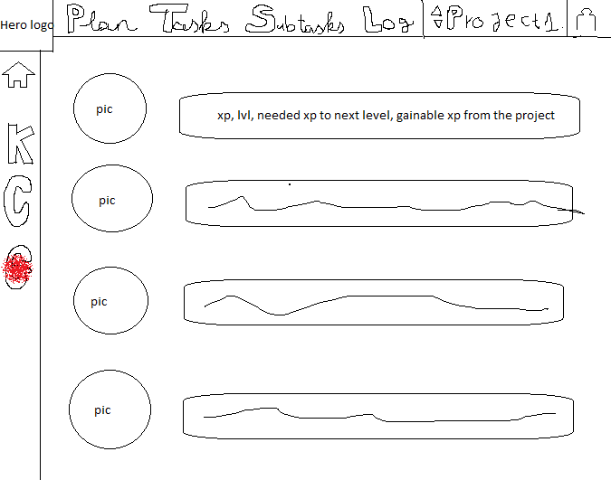

### Vízszintes sáv

#### Plan

Itt jelennek meg a határidők az egyes részekhez, ami segít jobban átlátni, hogy mely részt mikorra kell elvégezni. Látható ki mely feladatokhoz van rendelve, és hogy ki hogy halad a feladatokkal. Illetve majd itt lehet törölni a projektet admin által.

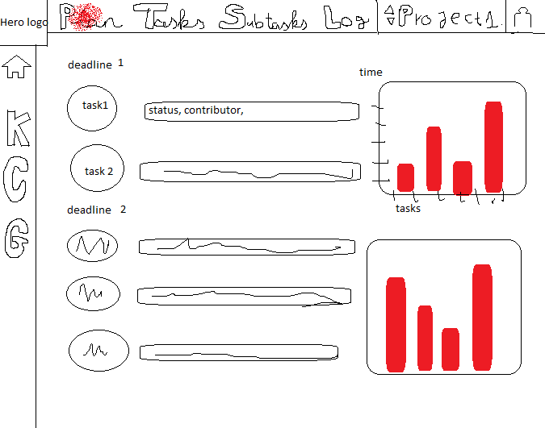

#### Tasks

A saját feladatainkat láthatjuk itt és itt tudunk visszajelzést küldeni, hogy hogyan állunk a feladatainkkal. Visszajelzés lehet work in progress, ready, starting to do, need help. A feladatokat határidő alatt soroljuk fel látva, mely feladattal kell kezdeni.

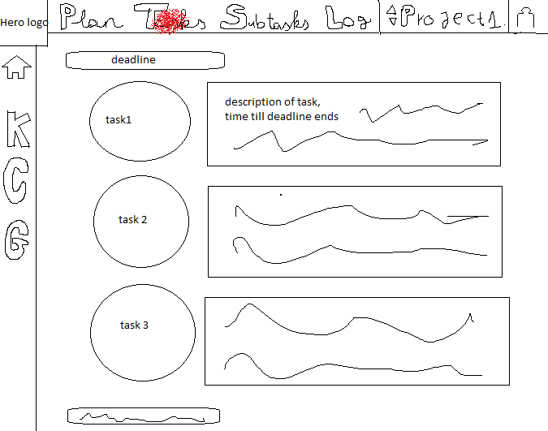

Előnyös lehet, ha minden fő feladatunkkal készen vagyunk időben.

#### SubTasks

Ugyanaz, mint a Tasks fül csak a mellékfeladatokkal.

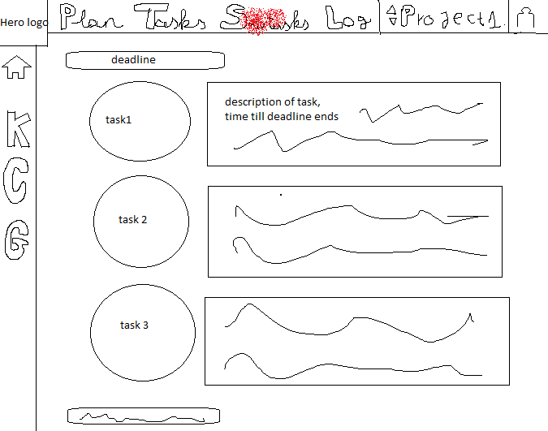

#### Log

Külön fül egy globális chathez, amire a felhasználók tudnak írni szövegesen, illetve egy bot fogja ide beírni, hogy ki mit kezdett el csinálni és ha állapotváltozás van(pl:task ready lett) kiírja azt is dátummal együtt, hogy segítse nyomon követni a munkálatokat mindenki által.

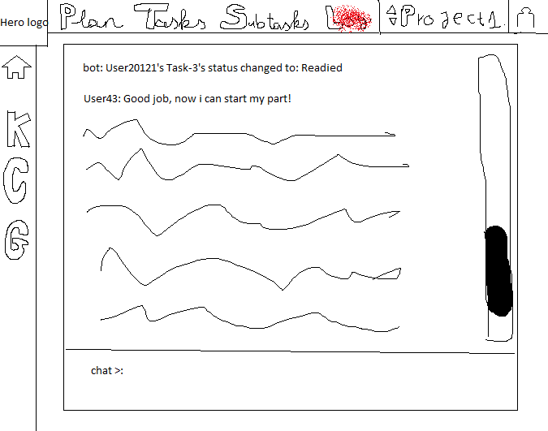

##### Chat bot

A chatbot a következőkről ír visszajelzést:

- Elkészült a projekt a kezdésre
- Minden feladat ki lett adva
- Valaki started-nek/Work in Progress-nek/Need Help-nek/Ready-nek jelez valamilyen feladatot/mellékfeladatot
- Valaki kész van minden munkájával
- Admin visszadob egy feladatot, ami nem jó, hogy a feladat felelőse újból csinálja meg, javítsa
- Projekt összes feladata sikeresen elkészült(Csak akkor írja ki, ha az admin sikeresnek zárja le a projektet)

#### Project név

Itt található a projekt neve, leginkább kiválasztásra alkalmas legördülő fül jeleniki meg a rákattintásnál.

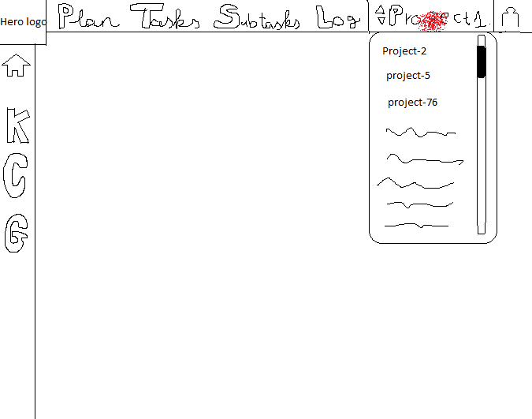

#### User ikon

Itt több mindent tudunk megnyitni a legördülő listából:

- Karakter
- Projektlétrehozás
- Bejelentkezés/Regisztráció vagy Kijelentkezés

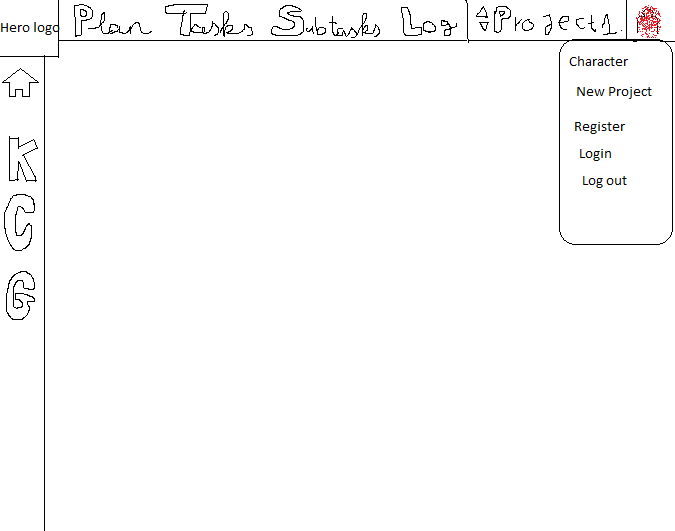

##### Karakter

Bejelentkezést követően elérhető a fül, itt a nevünket, Emailünket, jelszavunkat, karakter képünket és a badge alapján szerezhető kereteket állíthatjuk be

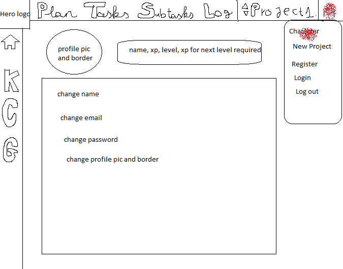

##### Projektlétrehozás

Ezen fülön tudjuk beállítani az új projekt nevét, határidejét, a contributorokat hozzáadni, a feladatokat létrehozni határidő alapján, maximum a sub task-oknál kell jelezni majd, melyik taskhoz kötődik, minden más automatikusan felépül majd az iterációban.

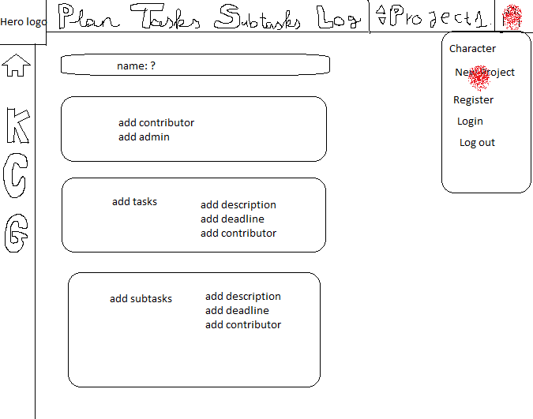

##### Bejelentkezés/Regisztráció

Alapvető főoldalon és ezen a fülön tudjuk magunkat oda írányítani, ahol regisztrálhatunk vagy bejelentkezhetünk. Alapvető email-felhasználó név-jelszó + hitelesítő kód emailre megoldás.

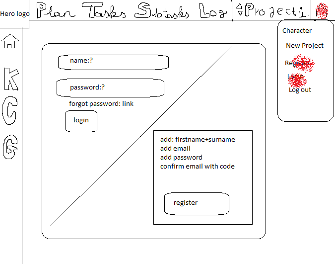

##### Kijelentkezés

A fiókból kijelentkezünk, hogy bejelentkezhessünk egy másikkal, vagy majd később újra a sajátunkba.

## Gamification

Az **Acxor** motivációt és élményt ad a feladatkezeléshez:

- **Pontozás és teljesítmény jelzés:** Minden teljesített task és subtask növeli a csapattag pontszámát.
- **Teljesítési szintek:** Sprint vagy projekt lezárása után a csapat és az egyének “achievementeket” kapnak.
- **Vizualizált haladás:** Színes státuszjelzők és haladási sávok ösztönzik a folyamatos munkát.

**Szinteződés**

- Minden teljesített Task 5xp-t, minden teljesített SubTask 3 xp-t ad.
- Minden Sprint project elvégzése 30xp-t ad
- Mindenki a level 1-től kezd, szintváltáshoz 20 + a következő szint tízszeresével megegyező xp-t kell gyüjteni. (to Level 4=> 20 + 4\*10 xp required)
- Szintlépésnél mindig kivonjuk a jelenlegi xp-ből az adott szint eléréséhez szükséges xp értéket

| xp before leveling | Level before +60 xp | xp after leveling                   | Level after +60xp                         |
| ------------------ | ------------------- | ----------------------------------- | ----------------------------------------- |
| 0                  | 1                   | 50-(20+2\*10)= 20                   | 2                                         |
| 40                 | 3                   | 90-(20+4\*10)= 40                   | 4                                         |
| 30                 | 1                   | 90-(20+2\*10)= 50-> 50-(20+3\*10)=0 | 3 (Két szintet is léphetünk elég ponttal) |

- Bizonyos szinteknél (5-10-15-20-25-30-35-40-majd minden következő elem 10-el nő) külön Badge-eket lehet szerezni, illetve, aki a legtöbb pontot gyüjtötte egy projekt során további 10 xp-t kap

## Összehasonlítás más szoftverekkel

| Funkció                    | Trello | Acxor          | Jira |
| -------------------------- | ------ | -------------- | ---- |
| Kanban board               | ✅     | ✅             | ✅   |
| Scrum / Sprint kezelés     | ❌     | ⚪ egyszerű    | ✅   |
| Issue típusok (Bug, Story) | ❌     | ⚪ lehetőség   | ✅   |
| Workflow testreszabás      | ❌     | ⚪ egyszerű    | ✅   |
| Részletes jelentések       | ❌     | ⚪ egyszerű    | ✅   |
| Integrációk                | ✅     | ⚪ korlátozott | ✅   |
| Automatizálás              | ❌     | ⚪ egyszerű    | ✅   |

### Hasonlóságok a Jira-val

#### Sprint-alapú munkavégzés

Az Acxor, a Jira-hoz hasonlóan, iterációkban (sprintekben) kezeli a projekteket.  
Minden projekthez meghatározható határidő, backlog, tasklista és státusz.  
A sprint csak akkor zárható le, ha minden feladat és alfeladat befejeződött.

#### Task–Subtask hierarchia

Akárcsak a Jira-ban, az Acxorban is minden fő feladat (task) felbontható subtaskokra, melyek részfeladatokat képviselnek.  
A státuszkezelés és a progressz-jelzés a Jira logikáját követi: **To Do → In Progress → Done**.

#### Projekt-specifikus statisztikák és felhasználói aktivitás

Az alkalmazás megmutatja, hogy ki mennyi időt töltött el egy feladattal, és milyen arányban vett részt a projektben.  
Hasonló a Jira “Reports” és “Velocity Chart” funkcióihoz, csak leegyszerűsítve és vizuálisabban.

#### Kanban nézet

Az Acxor is biztosít egy oszlopokra bontott, kártyás (Kanban) nézetet, ahol a feladatok státusz szerint rendeződnek.

### Hasonlóságok a Trello-val

#### Egyszerű, vizuális kezelőfelület

Az Acxor a Trello-hoz hasonlóan minimalista és intuitív, hogy a felhasználók technikai ismeretek nélkül is könnyen átlássák a projektet.  
A Kanban-board elrendezés, a kártyák és oszlopok rendszere a Trello inspirációjára készült.

#### Drag & Drop interakció

A taskok mozgatása és státuszváltása egyszerű kattintással vagy húzással történik.  
A vizuális visszajelzések (színek, ikonok, animációk) a Trello-hoz hasonlóak.

#### Web és mobil kompatibilitás

Mindkettő platformfüggetlen: böngészőből és mobilról is teljes értékűen használható.  
Az Acxor UI-ja a Trello mobil-egyszerűségét veszi alapul, de kiegészíti több adminisztratív funkcióval.

### Ami az Acxorban más, mint a Jira és a Trello

#### Függőségi rendszer – lineáris task logika

Az Acxor bevezeti azt a szabályt, hogy egy feladat csak akkor kezdhető el, ha az előző teljesült.  
Ez a funkció sem a Trello-ban, sem a Jira-ban nem alapértelmezett (Jira-ban plugin kell hozzá).  
Ennek köszönhetően a fejlesztési folyamat szekvenciálisan és kontrolláltan halad előre.

#### Gamifikációs rendszer

Egyedülálló elem az Acxorban:

- Minden task és subtask elvégzése XP-t ad.
- A felhasználók szintet lépnek, badge-eket kapnak, és teljesítmény szerint rangsorolhatók.  
  Ez motiválja a csapatokat, hogy aktívabbak és pontosabbak legyenek a határidők betartásában.  
  A Jira és Trello nem tartalmaz ilyen integrált motivációs rendszert.

#### Kettős nézet: Scrum és Kanban egyben

Az Acxorban a felhasználó egy kattintással válthat a Kanban és Scrum nézet között.  
Míg a Jira külön projekttípust kér a Scrum és Kanban boardhoz, az Acxor egyesíti a kettőt.  
Ez egyszerűsíti a kezelést: ugyanaz a projekt idő-alapú (Scrum) és folyamat-alapú (Kanban) módon is követhető.

#### Integrált kommunikáció (Log & Chat bot)

A Jira-ban a kommentek task-szinten történnek, míg a Trello-ban a kártyán belül.  
Az Acxor ehelyett egy globális kommunikációs panelt (Log) és egy intelligens botot használ, amely automatikusan jelzi:

- ha valaki új feladatot kezd,
- ha változott egy státusz,
- ha az admin visszadobott egy hibás feladatot,
- vagy ha a projekt lezárult.  
  Ez valós idejű transzparenciát ad az egész csapatnak.

#### Egységes projektstruktúra és automatikus iteráció

Új projekt létrehozásakor az Acxor automatikusan sprint-alapú szerkezetet épít fel,  
létrehozza az alap task-struktúrát, és lehetőséget ad a határidők és résztvevők beállítására.  
Ez sokkal gyorsabb bevezetést tesz lehetővé, mint a Jira részletes setup-ja vagy a Trello manuális táblalétrehozása.
