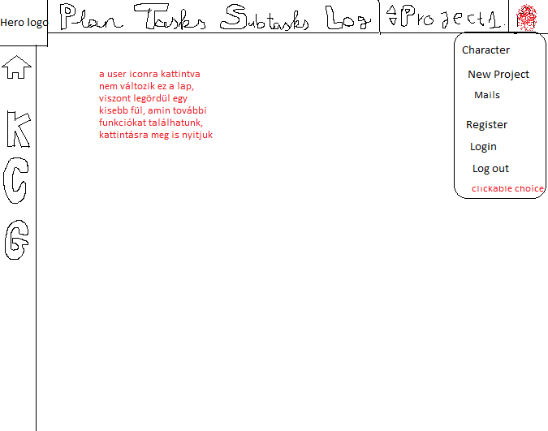

# Rendszerkövetelmények és specifikáció

## Kinézet

- Modern UI/UX kialakítás, ikonok használata, hover-nél pedig név mező kiírása
- Függőlegesen baloldalt és vízszintesen felül is helyezkednek el ikonok
- Hero Logo a két sáv találkozásánál

### Sávok elrendezése és alapvető információk

- A sávok (bal oldali + felső vízszintes menü) csak a kiválasztott projektre érvényesek, tehát projektspecifikusak,
  de maga a sávstruktúra és a navigációs logika globális, vagyis minden projekt esetén ugyanaz a felépítés.

#### Működés logikája

A Hero Logo és az általános információs lapok (pl. főoldal, wiki, sablonprojektek, kapcsolatfelvétel) minden projektre érvényesek, tehát globálisak.

Az alatta lévő funkcionális ikonok (Main, K, C, G) csak az aktívan kiválasztott projektre vonatkoznak.

A felhasználó projektváltáskor (pl. legördülőből másik projektet választ) a bal oldali ikonok ugyanazokat a nézeteket mutatják, de már az új projekt adataival.

### Függőleges sáv

#### Hero Logo ikon

Elsődleges oldal a weboldal/alkalmazás megnyitásakor. Itt helyezkednek a az alapvető információk az oldalról, külön lapok az oldal ismertetéséről, a bejelentkezés/regisztrációhoz, önálló wikihez, pár sablon projekthez ami majd ezzel a szoftverrel fog készülni, illetve a contact felület az oldal alján, ami minden résznél lesz.

#### Főmenü ikon

Itt a majd kiválasztott projectről lesz minden információ, aminek elengedhetetlen része a bejelentkezett felhasználó és hogy a projekthez csatlakozva legyen. Felszínesebben átláthatóbb a projekt részei, mely feladatok vannak készen és melyeken dolgoznak, határidők, hatékonyság statisztika arról, ki mennyit foglalkozott eddig az adott feladatokkal esetleg.

#### K ikon

A Kanban táblázatos nézetet nyitja meg, ami abban a nézetben fogja felvázolni a projektet az egyes feladatokkal, hogy mi hogyan kapcsolódik egymáshoz kisebb relációs eljárásokkal, melyek jelzik a subtask hierarchiát is.

#### C ikon

Az előbb leírtak modelnézete, csak Scrumban

#### G ikon

A gamifikáció oldalát nyitja meg, ahol ránézhetünk a contributorok teljesítményére. Ki milyen szinten áll, mennyi xp-je van, milyen badge-jei, és kb. mennyi xp-t fog eddig bezsebelni a projektből(Versengést idézhet elő azért a plusz 10xp-ért a projekt végére motiválva a felhasználókat a munkára)

### Vízszintes sáv

#### Plan

Itt jelennek meg a határidők az egyes részekhez, ami segít jobban átlátni, hogy mely részt mikorra kell elvégezni. Látható ki mely feladatokhoz van rendelve, és hogy ki hogy halad a feladatokkal. Illetve majd itt lehet törölni a projektet admin által.

#### Tasks

A saját feladatainkat láthatjuk itt és itt tudunk visszajelzést küldeni, hogy hogyan állunk a feladatainkkal. Visszajelzés lehet work in progress, ready, starting to do, need help. A feladatokat határidő alatt soroljuk fel látva, mely feladattal kell kezdeni.

Előnyös lehet, ha minden fő feladatunkkal készen vagyunk időben.

#### SubTasks

Ugyanaz, mint a Tasks fül csak a mellékfeladatokkal.

#### Log

Külön fül egy globális chathez, amire a felhasználók tudnak írni szövegesen, illetve egy bot fogja ide beírni, hogy ki mit kezdett el csinálni és ha állapotváltozás van(pl:task ready lett) kiírja azt is dátummal együtt, hogy segítse nyomon követni a munkálatokat mindenki által.

##### Chat bot

A chatbot a következőkről ír visszajelzést:

- Elkészült a projekt a kezdésre
- Minden feladat ki lett adva
- Valaki started-nek/Work in Progress-nek/Need Help-nek/Ready-nek jelez valamilyen feladatot/mellékfeladatot
- Valaki kész van minden munkájával
- Admin visszadob egy feladatot, ami nem jó, hogy a feladat felelőse újból csinálja meg, javítsa
- Projekt összes feladata sikeresen elkészült(Csak akkor írja ki, ha az admin sikeresnek zárja le a projektet)

#### Project név

Itt található a projekt neve, leginkább kiválasztásra alkalmas legördülő fül jelenik meg a rákattintásnál.

#### User ikon

Itt több mindent tudunk megnyitni a legördülő listából:

- Karakter
- Projektlétrehozás
- Bejelentkezés/Regisztráció vagy Kijelentkezés

##### Karakter

Bejelentkezést követően elérhető a fül, itt a nevünket, Emailünket, jelszavunkat, karakter képünket és a badge alapján szerezhető kereteket állíthatjuk be

##### Projektlétrehozás

Ezen fülön tudjuk beállítani az új projekt nevét, határidejét, a contributorokat hozzáadni, a feladatokat létrehozni határidő alapján, maximum a sub task-oknál kell jelezni majd, melyik taskhoz kötődik, minden más automatikusan felépül majd az iterációban.

##### Mails (Levelek)

Ezen fülön tudjuk megnézni a bejövő leveleket, illetve írhatunk levelet másoknak.

##### Bejelentkezés/Regisztráció

Alapvető főoldalon és ezen a fülön tudjuk magunkat oda írányítani, ahol regisztrálhatunk vagy bejelentkezhetünk. Alapvető email-felhasználó név-jelszó + hitelesítő kód emailre megoldás.

##### Kijelentkezés

A fiókból kijelentkezünk, hogy bejelentkezhessünk egy másikkal, vagy majd később újra a sajátunkba.

#### Feladat Státuszai

- **Starting:** A feladat létre lett hozva, de a munka még nem kezdődött el.
- **To Do:** A projekt elindulásakor kerül ebbe az állapotba; a feladat elkezdésre vár.
- **Help Needed:** A feladat elakadt, és a felhasználó segítséget kér.
- **Review:** A feladat elkészült, ellenőrzésre és jóváhagyásra vár.
- **Done:** A feladat teljesen elkészült és jóváhagyott.

### Saját Wiki

Az **Acxor Saját Wiki** modulja egy **beépített, zárt tudásbázis**, amely a rendszerhez és a projektekhez kapcsolódó dokumentációk, útmutatók és leírások központi tárhelyeként szolgál.  
A célja, hogy minden felhasználó számára **átlátható, egységes és hiteles információforrást** biztosítson, miközben a tartalom kezelése kizárólag a kijelölt adminisztrátorok hatáskörébe tartozik.

#### Fő jellemzők

- **Szerkesztési jogosultság:**  
  Csak a **Globális Admin** (rendszeradminisztrátor) jogosult a wiki tartalmának létrehozására, szerkesztésére és törlésére.  
  Minden más felhasználó (beleértve a Project Adminokat, Contributorokat és nézőket) **csak olvasási jogosultsággal** rendelkezik.

- **Tartalmi struktúra:**  
  A wiki oldalai kategóriákba rendezve jelennek meg (pl. „Használati útmutató”, „Rendszerleírás”, „Sablonprojektek”, „Szabályzatok”).  
  Minden bejegyzéshez metaadatok (pl. létrehozás dátuma, szerkesztő, verzió) tartoznak, így könnyen követhető a frissítések története.

- **Célja és funkciója:**

  - A rendszer működésének, használatának és fejlesztési elveinek dokumentálása.
  - Központi tudásbázis a felhasználók és fejlesztők számára.
  - Segítség az új felhasználók betanításában és a projektek egységes működésének fenntartásában.
  - Hivatkozások, képek és példák formájában részletes magyarázatokat tartalmazhat.

- **Elérhetőség:**  
  A wiki minden bejelentkezett felhasználó számára **globálisan elérhető és olvasható**, függetlenül attól, hogy mely projektekhez tartozik.

#### Összegzés

Az Acxor Saját Wiki egy **önálló, belső „miniwikipédia”**, de **nem közösségi szerkesztésű**.  
Feladata, hogy egységes, hiteles és központilag karbantartott tudásbázist nyújtson, amely biztosítja a rendszer átláthatóságát, a projektfolyamatok követhetőségét, valamint az új felhasználók gyors beilleszkedését.

### Célközönségi flexibilitás

Az **Acxor** fejlesztése során kiemelt szempont a **célközönségi flexibilitás**, vagyis hogy a rendszer **különböző felhasználói típusokhoz és munkastílusokhoz** egyaránt képes alkalmazkodni.  
Ez azt jelenti, hogy az alkalmazás nem csak egy konkrét szakmai rétegre (pl. fejlesztőcsapatokra) korlátozódik, hanem bármilyen együttműködést, projektalapú munkát vagy tanulási folyamatot képes támogatni.

- **Szoftverfejlesztési projektek**

  - Fejlesztési sprint-ek kezelése
  - Hibajegyek, backlogok és kódfejlesztési folyamatok nyomon követése

- **Oktatási és tanulási projektek**

  - Tanfolyamok, vizsgák, modulok vagy tananyagok követése
  - XP és badge alapú motiváció diákok számára (pl. “tanulási gamifikáció”)

- **Kutatási projektek**

  - Feladatok, határidők, adatgyűjtési folyamatok koordinálása
  - Jegyzetek és dokumentációk tárolása a beépített wiki modulban

- **Kreatív és művészeti projektek**

  - Közös tartalomkészítés (zene, design, írás, videó) feladatokra bontva
  - Csapaton belüli együttműködés és értékelés

- **Vállalati és irodai munkafolyamatok**

  - Belső folyamatok, kampányok, HR-feladatok vagy adminisztratív teendők kezelése
  - Projektek közötti XP- és teljesítmény-összehasonlítás

- **Közösségi vagy nonprofit projektek**

  - Önkéntes munkák, eseményszervezések, adománygyűjtések koordinálása
  - Résztvevők motiválása badge-ekkel és elismerésekkel

- **Személyes célmenedzsment**
  - Saját fejlődési vagy produktivitási célok követése
  - Mindennapi feladatok “játékszerű” rendszerezése XP-k és szintek alapján

#### Jellemzői:

- **Rugalmas felépítés:** a felhasználók igényei szerint alakítható, legyen szó céges, oktatási vagy közösségi projektről.
- **Szerepalapú működés:** a rendszer különböző szerepköröket (pl. admin, contributor, viewer) biztosít, így mindenki a számára releváns funkciókat látja.
- **Skálázható komplexitás:** egyszerű feladatkezelőként és nagyobb projektmenedzsment rendszerként is használható.

A cél, hogy az Acxor ne egy szűk felhasználói réteget szolgáljon ki, hanem **széles körben testreszabható legyen**, alkalmazkodva a felhasználók működéséhez és igényeihez.

### Letisztultabb kinézet

Az Acxor felülete **minimalista, modern és funkcionálisan átgondolt**.  
A „letisztultabb kinézet” azt jelenti, hogy a felhasználói élmény középpontjában az **áttekinthetőség, gyors navigáció és vizuális egyensúly** áll.  
Nem a felesleges grafikai elemek dominálnak, hanem a tartalom, a struktúra és a könnyű használhatóság.

#### Kiemelt jellemzők:

- Egységes színpaletta és ikonrendszer.
- Reszponzív, jól olvasható tipográfia.
- Funkcióközpontú elrendezés, kevés vizuális zajjal.
- A gamifikációs elemek (badge-ek, szintek, XP) vizuálisan megjelennek, de nem zavarják a munkát.

A letisztult dizájn segíti a fókuszált munkavégzést, miközben **esztétikus, professzionális megjelenést** biztosít minden platformon.

### Online működés

Az **Acxor** kizárólag **online működésre** tervezett rendszer, ami azt jelenti, hogy minden adat, projekt, kommunikáció és tevékenység **felhőalapon** zajlik, és **valós időben szinkronizálódik** az összes felhasználó között.  
Ez biztosítja az azonnali együttműködést, a naprakész információkat és az adatok folyamatos elérhetőségét.

#### Fő jellemzők:

- **Valós idejű frissítés:**  
  Minden feladat, státuszváltozás, XP-gyűjtés és üzenet azonnal megjelenik minden csapattag felületén.

- **Központi adattárolás:**  
  Az összes adat biztonságosan a felhőben kerül tárolásra, így nincs szükség helyi mentésre vagy manuális szinkronizálásra.

- **Közvetlen kommunikáció:**  
  Az online működés lehetővé teszi a **Global Chat**, értesítések és projekt-hozzászólások valós idejű használatát.

- **Böngésző és mobil kompatibilitás:**  
  Az Acxor webes és mobilfelületei is folyamatos internetkapcsolatot igényelnek, így az információk mindig naprakészek maradnak.

- **Biztonságos hozzáférés:**  
  A bejelentkezés, jogosultságkezelés és adatvédelem teljes mértékben a szerveroldalon zajlik, ezáltal az adatok integritása és biztonsága garantált.

#### Előnyök:

- Minden projekt és kommunikáció **egy központi rendszerben** történik.
- A csapattagok **valós időben dolgozhatnak együtt**, bárhonnan és bármilyen eszközről.
- Az adatok elvesztésének kockázata minimális, hiszen minden a felhőben kerül tárolásra.

## Szerepkörök

- Az Acxor három fő szerepkört különböztet meg projektszinten, valamint egy negyediket globális rendszerszinten.
  A szerepkörök jogosultsági szintekre épülnek, és meghatározzák, ki mit láthat, módosíthat vagy hozhat létre az alkalmazásban.

### Project Admin

- A projekt létrehozója automatikusan admin lesz.
- Teljes hozzáférése van az adott projekthez.
- Feladata: a projekt struktúrájának kezelése, tagok hozzáadása, sémák, határidők és státuszok beállítása.

**Jogosultságai:**

- Projekt létrehozása / módosítása / törlése
- Felhasználók hozzáadása, eltávolítása, jogosultság módosítása
- Taskok, Subtaskok, Sprintek létrehozása és kiosztása
- Task státuszok visszavonása (“visszadobás”)
- Projekt zárása és XP kiosztás megerősítése
- Chat-bot üzenetek validálása (pl. projekt lezárásakor)

### Contributor (Közreműködő)

- A projekt aktív tagja, aki feladatokat kap és azokon dolgozik.
- Felelős saját taskjaiért, státuszuk frissítéséért és a projekt előrehaladásáért.
- Részt vesz a csapatkommunikációban és a gamifikációban.

**Jogosultságai:**

- Saját taskok és subtaskok megtekintése, státusz módosítása
- Új subtask javaslása
- Kommunikáció a Log / Chat felületen
- Saját teljesítmény statisztika és XP megtekintése
- Badge-ek és szintek követése

### Viewer (Megfigyelő – opcionális)

- Csak olvasási joggal rendelkezik az adott projekthez.
- Ideális külső érdeklődők, ügyfelek vagy oktatók számára.
- Nem tud módosítani, csak betekintést nyer a projekt állapotába.

**Jogosultságai:**

- Projektadatok (dashboard, Kanban, Scrumban, Gamification) megtekintése
- Nincs módosítási jog
- Nincs chat hozzáférés
- Statisztikák és előrehaladás olvasása

### Global Admin (Rendszerszintű admin)

- A teljes Acxor rendszer kezelője, nemcsak egyetlen projekthez kötődik.
- Felelős minden projekt, felhasználó és beállítás felügyeletéért.
- Fő célja a rendszer működésének fenntartása és karbantartása.

**Jogosultságai:**

- Összes projekt és felhasználó megtekintése és módosítása
- Globális beállítások kezelése (pl. XP-szabályok, integrációk, licenc)
- Inaktív projektek archiválása vagy törlése
- Felhasználók felfüggesztése, jogosultság módosítása
- Teljes rendszerstatisztika és riportok megtekintése
- Gamifikációs rendszer paramétereinek beállítása
- Hibák és visszaélések kezelése

## Gamification

Az **Acxor** motivációt és élményt ad a feladatkezeléshez:

- **Pontozás és teljesítmény jelzés:** Minden teljesített task és subtask növeli a csapattag pontszámát.
- **Teljesítési szintek:** Sprint vagy projekt lezárása után a csapat és az egyének “achievementeket” kapnak.
- **Vizualizált haladás:** Színes státuszjelzők és haladási sávok ösztönzik a folyamatos munkát.
- **Class-ok bevezetése:** Bizonyos szintektől újabb és újabb osztály kitüntetéseket lehet szerezni, amikhez egyedi háttérképet kapnak a felhasználók.

**Szinteződés**

Az Acxor projektmenedzsment rendszerében a gamifikáció célja a felhasználók motiválása és a csapattagok aktivitásának ösztönzése. A rendszer az alábbi logikára épül:

### Prestige és szintkövetelmény

Minden szintlépés XP-követelménye a következő képlettel számolható:

**XP required = 20 + (next_level \* 10) + (prestige*level * 10)**

- **Prestige 0, Level 1:** 20 + (2 \* 10) + (0 \* 10) = 40 XP
- **Prestige 1, Level 1:** 20 + (2 \* 10) + (1 \* 10) = 50 XP

Ez a képlet minden szintnél érvényes, így a prestige szint növeli az XP követelményt a további szintekhez.

#### XP pontok

- **Task teljesítése:** +5 XP
- **SubTask teljesítése:** +3 XP
- **Sprint / projekt lezárása:** +30 XP
- **Legjobb teljesítmény:** A legtöbb pontot gyűjtő contributor további +10 XP-t kap.

#### Szintek és szintlépés

- Minden felhasználó **level 1**-ről indul.
- Szintlépéskor az aktuális XP-ből mindig levonásra kerül a következő szinthez szükséges érték.
- Például:
  - Level 1 → Level 2 (Prestige 0): 20 + (2\*10) + (0\*10) = 40 XP
  - Level 4 → Level 5 (Prestige 0): 20 + (5\*10) + (0\*10) = 70 XP

#### Badge-ek

- Különleges szinteknél (5, 10, 15, 20, 25, 30, 35, 40, 45, 50) badge-ek szerezhetők.
- A badge-ek **háttérképként is használhatók**, és minden megadott szintfordulónál a játékos választhat 3 különböző **class** közül, amelyek egyedi hátteret biztosítanak.
  - Példa: **Level 5** → választható osztályok: Freelancer, Swordsman, Archer.

#### Prestige rendszer

- Minden **50. szintnél** a felhasználó prestige-t érhet el, ami új határokat ad a profilhoz.
- A prestige célja a hosszú távú játékosság fenntartása és a profil vizuális kiemelése.

| Prestige | xp before leveling | Level before +60 xp | xp after leveling with +60 xp                         | Level after +60xp                         |
| -------- | ------------------ | ------------------- | ----------------------------------------------------- | ----------------------------------------- |
| 1        | 0                  | 1                   | 60-[(20+2\*10)+(1*10)]= 10                            | 2                                         |
| 2        | 40                 | 3                   | 100-[(20+4\*10)+(3*10)]= 10                           | 4                                         |
| 0        | 30                 | 1                   | 90-[(20+2\*10)+(0*10)]= 50-> [50-(20+3\*10)+(0*10)]=0 | 3 (Két szintet is léphetünk elég ponttal) |
